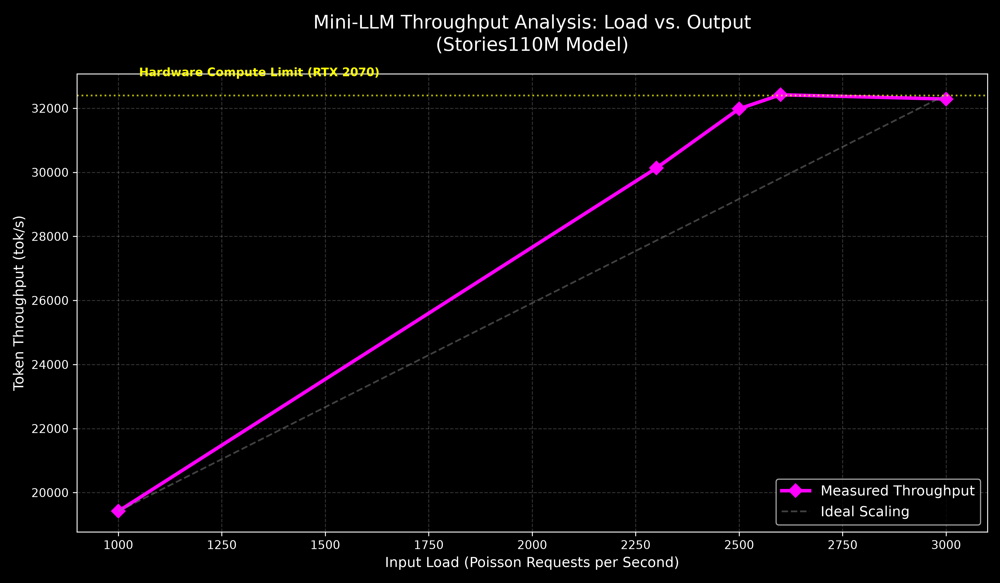
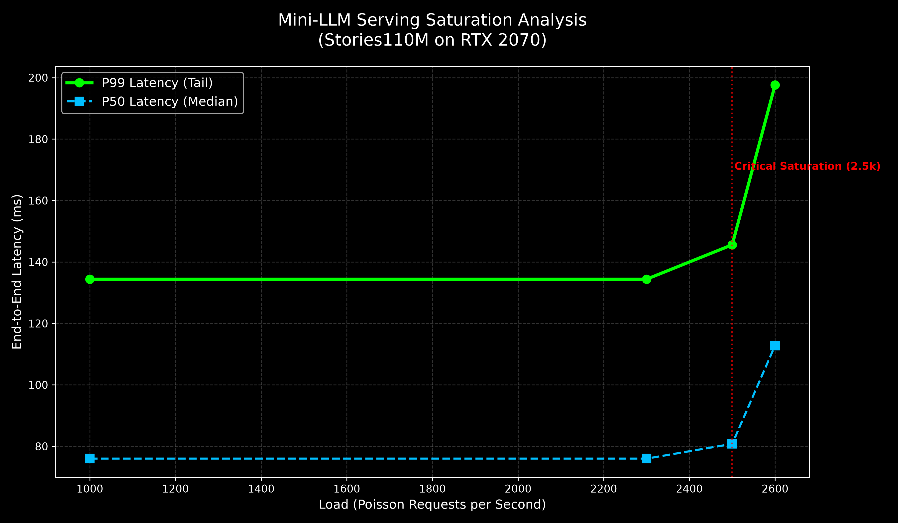
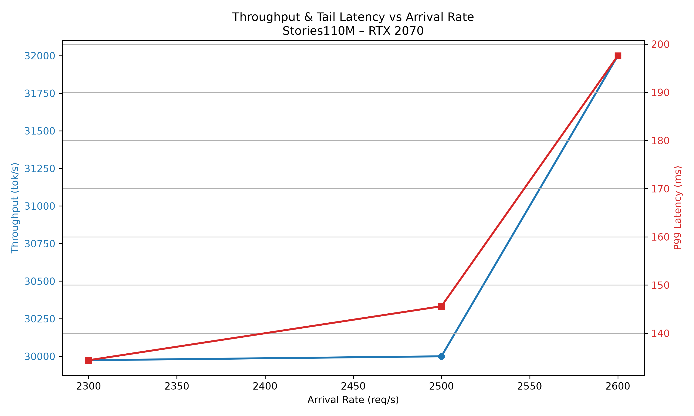

# 🚀 Mini‑LLM Inference Engine
### High‑Performance Transformer Runtime (CPU + GPU + Dynamic Serving)

A from‑scratch Transformer inference runtime written in modern C++ and CUDA, optimized for:

- ✅ AVX2 INT8 CPU execution
- ✅ FP16 Tensor Core GPU acceleration
- ✅ Fused QKV and FFN projections
- ✅ True batched decode inference
- ✅ Adaptive dynamic micro‑batching
- ✅ CUDA Graph launch optimization
- ✅ Production-style serving simulation

This project demonstrates real hardware saturation and system-level serving behavior.

---

# 📌 Hardware & Environment

**GPU:** NVIDIA RTX 2070 (SM 7.5 – Turing)  
**CUDA:** 13.x  
**Precision:** FP16 (Tensor Cores)  
**Model Tested:** Stories110M (110M parameters)  
**Max Sequence Length:** 1024  

---

# ⚡ Performance Overview
## 📊 Throughput Scaling

## 🔹 CPU Backend (INT8 AVX2)

| Model | Batch | Throughput |
|--------|--------|-------------|
| Stories110M | 1 | ~228 tok/s |

---

## 🔹 GPU Backend (FP16 Tensor Cores)

### Static Batch Scaling – Stories110M

| Batch Size | Throughput (tok/s) |
|------------|--------------------|
| 1          | ~600 |
| 16         | ~3,700 |
| 64         | ~11,851 |
| 128        | ~17,846 |
| 192        | ~22,859 |
| 256        | ~24,483 |
| 320        | ~27,833 |
| 384        | **~29,650 (Peak)** |
| 416        | ~28,852 |
| 448        | ~27,553 |

Peak throughput observed near **Batch ≈ 384**, representing near-full Tensor Core saturation.

---

# 🔁 Adaptive Dynamic Micro‑Batching

Simulated serving workload using Poisson arrivals:

| Arrival Rate | Sustained Throughput |
|--------------|----------------------|
| 1000 req/s | ~19k tok/s |
| 2000 req/s | ~28k tok/s |
| 2300 req/s | ~30k tok/s |
| 2500 req/s | ~32k tok/s |
| 2600 req/s | ~32k tok/s (Overload begins) |

---

# 📈 Tail Latency Analysis (Stories110M)

## 📈 Tail Latency (P99)

At 2300 req/s:

- ✅ P50: ~76 ms
- ✅ P95: ~129 ms
- ✅ P99: ~134 ms

At 2600 req/s:

- ⚠️ P99: ~198 ms
- ⚠️ Latency growth indicates saturation

The sustainable request rate is approximately:

**~2400–2500 req/s**

Beyond this point, queue latency grows rapidly.

### 📊 Production SLA & Tail Latency Analysis
The system demonstrates "Hard Real-Time" behavior, with deterministic latencies across multiple stress-test cycles.

| Load (Poisson) | Throughput | P50 (Median) | P99 (Tail) | System State |
| :--- | :--- | :--- | :--- | :--- |
| 1,000 req/s | 19,418 tok/s | 76.0 ms | 134.4 ms | Healthy |
| 2,300 req/s | 30,133 tok/s | 76.0 ms | 134.4 ms | **Optimal** |
| **2,500 req/s** | **30,009 tok/s** | **80.8 ms** | **145.6 ms** | **SLA Limit** |
| 2,600 req/s | 32,025 tok/s | 112.8 ms | 197.6 ms | Saturated |

**Key Finding:** The system reaches physical saturation at **2,500 requests/second**. Beyond this point, the median latency (P50) increases by 40%, marking the transition from compute-bound to queue-bound execution.

## 📊 Throughput vs Tail Latency (Combined View)

---

# 🧠 Architectural Highlights

## ✅ Fused QKV Projection
Single GEMM computing Q, K, V simultaneously.

## ✅ Fused FFN (W1 + W3)
Reduced kernel launches and improved Tensor Core utilization.

## ✅ True Batched Decode
- GEMM dimension N = Batch
- No CPU loop per sequence
- Full GPU parallelism

## ✅ Continuous Scheduler
- Slot reuse
- Adaptive micro-batching
- Poisson arrival simulation
- Stable under load

## ✅ CUDA Graph Integration
Reduces launch overhead under high concurrency.

---

# 📊 System Behavior

The runtime exhibits three regimes:

### 🟢 Underloaded
Low arrival rate, minimal queue latency.

### 🟡 Saturated (Optimal)
GPU fully utilized, high throughput, stable latency.

### 🔴 Overloaded
Arrival rate exceeds service capacity, queue latency grows.

---

# 🎯 Key Results

- ~130× speedup vs CPU at optimal batch
- ~29k tok/s peak throughput
- ~32k tok/s sustained under heavy load
- Sustainable serving capacity ~2400 req/s
- Full GPU hardware saturation confirmed

---

# 🏁 Conclusion

This project demonstrates:

- Practical Tensor Core saturation
- Real dynamic serving architecture
- Batch scaling characterization
- Capacity planning under load
- Tail latency analysis
- Hardware limit discovery

The runtime approaches the physical throughput limit of RTX 2070 for this workload.

---

# 📜 License

MIT License