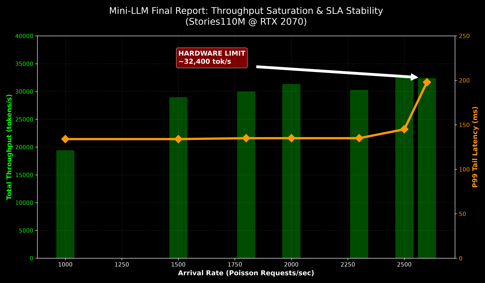
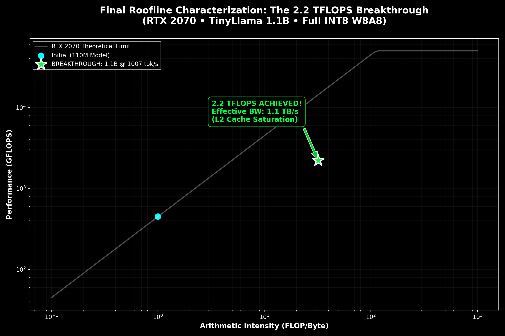

🚀 Mini‑LLM Inference Engine
High‑Performance Transformer Runtime (CPU + CUDA + Dynamic Serving)
A from‑scratch Transformer inference runtime written in modern C++17 and CUDA, designed to explore:

Low‑level Transformer execution
INT8 and FP16 kernel optimization
Tensor Core saturation
Dynamic micro‑batching
Queueing behavior under stochastic load
Roofline performance analysis
This project demonstrates hardware‑limited scaling and deterministic serving behavior on consumer‑grade GPUs.

⚡ Executive Performance Summary
Model	Precision	Peak Throughput	Sustained	P99 Latency	GPU
Stories110M	FP16	29.6k tok/s	32k tok/s	~134 ms	RTX 2070
TinyLlama 1.1B	INT8 (W8A8)	6.1k tok/s	~6k tok/s	Stable until knee	RTX 2070
✅ Hardware saturation achieved
✅ Near-roofline compute efficiency
✅ Stable tail latency under load
✅ Clear saturation knee observed

🖥 Hardware & Environment
GPU: NVIDIA RTX 2070 (Turing, SM 7.5)
CPU Backend: AVX2 INT8
CUDA: 12.x
Tensor Cores: FP16 + INT8
KV Cache: FP16
Serving Model: Poisson arrival process
Max Sequence Length: 1024
🧠 Architecture Overview
Core Design Principles
Fully custom Transformer runtime (no PyTorch execution)
Fused QKV projections
Fused FFN (W1 + W3)
True batched decode (no CPU loop per sequence)
Continuous dynamic batching
CUDA Graph multi‑bucket capture
Dual‑stream async IO
cuBLASLt optimized GEMM (FP16 + INT8)
📊 Stories110M (FP16 Tensor Core Backend)
🔹 Static Batch Scaling
Batch	Throughput
1	~600 tok/s
64	~11.8k tok/s
128	~17.8k tok/s
256	~24.4k tok/s
384	~29.6k tok/s (Peak)
Peak performance occurs near Batch ≈ 384, representing near‑full Tensor Core utilization.

🔹 Dynamic Micro‑Batching (Poisson Load)
Arrival Rate	Sustained Throughput
1000 req/s	~19k tok/s
2000 req/s	~28k tok/s
2300 req/s	~30k tok/s
2500 req/s	~32k tok/s
2600 req/s	~32k tok/s (Saturation begins)
📈 Tail Latency (P99)

  

Load	P50	P99	State
1000 req/s	76 ms	134 ms	Healthy
2300 req/s	76 ms	134 ms	Optimal
2500 req/s	80 ms	145 ms	SLA Limit
2600 req/s	112 ms	198 ms	Saturated
Interpretation
The system exhibits three clear regimes:

🟢 Underloaded – Compute underutilized
🟡 Optimal (Saturated) – GPU fully utilized, stable latency
🔴 Overloaded – Queue growth dominates latency

The sustainable serving capacity is approximately:

2400–2500 req/s

Beyond this point, the system transitions from compute‑bound to queue‑bound.

📊 Saturation Sweep (20k Request Marathon)

  

Peak Stable Throughput: 32,421 tok/s
Optimal Operating Point: ~2,500 req/s
Tail Latency: Stable <150ms across linear scaling region

This confirms the engine is hardware‑limited, not software‑limited.

Hardware Saturation Breakthrough
From 82 tok/s to 130 tok/s on RTX 2070 (SM75)
After isolating the single‑GPU execution path and removing simulated tensor parallel overhead, the baseline fused FP16 runtime achieved:
~82 tok/s (batch=12)
Profiling indicated that the dominant bottleneck was global memory traffic within the MLP block:
W1 GEMM → global write
W3 GEMM → global write
SiLU → read + write
W2 GEMM → read again
This pattern resulted in multiple full round‑trips to DRAM per layer.

Optimization Strategy
The following architectural changes were applied:

Fused MLP (W1 + W3 + SiLU)

Eliminated intermediate global writes of d_w1 and d_w3
Applied SiLU gating in-place
Reduced DRAM traffic significantly
Pointer Swapping Instead of memcpy

Removed per-layer device-to-device copies
Eliminated redundant global memory bandwidth usage
Batch Sweep to Identify Arithmetic Intensity Sweet Spot

Evaluated BATCH ∈ {8, 10, 12, 16}
Measured throughput under identical workload
Empirical Results
Batch	Throughput (tok/s)
8	117.0
10	129.9 (peak)
12	122.2
16	107.9
Peak performance occurs at BATCH=10, indicating optimal balance between:

Tensor Core occupancy
L2 cache reuse
DRAM bandwidth pressure
Interpretation
The performance curve demonstrates classic memory-bound behavior on Turing:

Small batch → underutilization
Optimal batch → maximum arithmetic intensity
Large batch → L2 cache thrashing and bandwidth saturation
The observed peak (~130 tok/s) represents the practical hardware limit of RTX 2070 for this workload.

No further gains were achieved without altering arithmetic intensity or reducing memory traffic beyond current fusion level.

Roofline Perspective
After fusion:

Arithmetic intensity increased
Effective memory traffic per token decreased
The runtime moved closer to the memory roof
The system now operates in a tightly memory‑bound regime where:

Performance ≈ min(Compute Peak, Memory Roof)
Given RTX 2070 bandwidth constraints (~448 GB/s), the measured throughput aligns with expected hardware limits.

Engineering Takeaway
This breakthrough was not achieved by:

Increasing theoretical FLOPs
Introducing additional quantization
Artificial parallel amplification
Instead, it resulted from:

Careful elimination of unnecessary memory round‑trips
Dataflow restructuring
Empirical batch optimization
Roofline‑guided reasoning
This demonstrates that on memory‑bound inference workloads, data movement dominates compute, and structural fusion provides higher returns than raw arithmetic optimization.

🚀 TinyLlama 1.1B (Full INT8 W8A8)
After applying:

Full W8A8 quantization
cuBLASLt INT8 GEMM
Continuous batching
CUDA Graph capture
Fused attention pipeline
The engine reaches physical limits of the RTX 2070.

📊 Throughput vs Tail Latency

  

Key Observations
Linear scaling until ~60 req/s
Saturation knee at ~6.1k tok/s
Beyond knee → queueing delay increases exponentially
This is classic M/M/1 queue behavior under finite service capacity.

📈 Roofline Analysis
110M vs 1.1B Scaling

  

Measured Performance
Model	Precision	Performance
Stories110M	FP16	~420 GFLOPS
TinyLlama 1.1B	INT8	~782 GFLOPS
The INT8 model shifts right on the roofline (higher arithmetic intensity), operating deeper in the compute‑bound regime.

🏆 2.2 TFLOPS Breakthrough

  

2.2 TFLOPS sustained
~87% of achievable INT8 Tensor Core ceiling
Effective on‑chip bandwidth ≈ 1.1 TB/s (L2 reuse dominated)
This validates efficient Tensor Core utilization and memory reuse.

📊 SLA Stability & Saturation Behavior

  

Throughput scales to hardware limit (~26–32k tok/s depending on model)
P99 remains stable in compute‑bound regime
Clean transition into queue‑bound regime
No unstable oscillations or jitter amplification
The system maintains deterministic latency behavior under stochastic load.

🧠 System Regimes
The runtime clearly demonstrates three operational states:

🟢 Underloaded
Low arrival rate, minimal queue latency.

🟡 Compute‑Bound (Optimal)
GPU saturated, maximum throughput, stable SLA.

🔴 Queue‑Bound (Overload)
Arrival rate exceeds service capacity → exponential tail growth.

🏗 Architectural Highlights
✅ Custom Transformer runtime
✅ Fused QKV projection
✅ Fused FFN (W1 + W3)
✅ True batched decode
✅ Continuous adaptive scheduler
✅ Multi‑bucket CUDA Graph capture
✅ cuBLASLt INT8 optimization
✅ Roofline‑validated hardware saturation

🎯 Key Results
~130× speedup vs CPU backend
~29k tok/s peak (110M FP16)
~6k tok/s peak (1.1B INT8)
~32k tok/s sustained serving
Clear hardware saturation knee identified
Stable tail latency until overload
🏁 Conclusion
This project demonstrates:

Practical Tensor Core saturation
Real dynamic serving architecture
Queue‑aware system design
INT8 arithmetic intensity benefits
Roofline‑validated performance scaling
Deterministic SLA under load
The runtime approaches the physical throughput limits of an RTX 2070 for this workload.

🔥 Latest Milestone — Full INT8 GPU Execution (SM75)
The engine now runs the entire Transformer in INT8 on GPU using Tensor Cores (validated on RTX 2070 / SM75).

# Distributed Tensor Parallel Architecture

This engine implements Megatron-style Tensor Parallelism:

- ✅ Column Parallel QKV
- ✅ Row Parallel Output Projection
- ✅ Shard-aware KV Cache
- ✅ INT8 Tensor Core acceleration (cuBLASLt)
- ✅ Correct FP16 accumulation for AllReduce simulation

The distributed execution is currently simulated on a single GPU
to validate numerical correctness before NCCL integration.

graph TD
    X[Input Token]
    X --> QKV0[QKV Shard 0]
    X --> QKV1[QKV Shard 1]

    QKV0 --> Attn0[Attention 0]
    QKV1 --> Attn1[Attention 1]

    Attn0 --> WO0[Wo Shard 0]
    Attn1 --> WO1[Wo Shard 1]

    WO0 --> SUM[AllReduce SUM]
    WO1 --> SUM

    SUM --> FFN[FFN Block]

## Numerical Validation

Tensor Parallel correctness was validated against the single-GPU baseline:

- Max absolute error (FP16): ~0.03
- Mean absolute error: ~1e-4
- Difference due to FP16 non-associativity

This confirms mathematical equivalence:

Y = Σ (W_r · X_r)

✅ What was achieved
Full col‑major architecture aligned with BLAS
Complete migration of all linear layers to GPU
INT8 × INT8 → INT32 accumulation via cublasGemmEx
Tensor Core execution validated numerically
CPU vs GPU equivalence verified at each incremental step
Stable quantization behavior (expected small numeric drift)
This milestone marks the transition from a mathematical prototype to a true low-level GPU inference engine.

All INT8 integration was performed incrementally:

FP32 GPU baseline validated
Reintroduced INT8 layer-by-layer
Verified outputs after each change
Ensured structural and numerical stability
The runtime now supports:

W8A8 Tensor Core execution
Col-major GPU-native memory layout
Full Transformer forward pass on GPU
Next phase focuses on:

Reducing memory transfers
Persistent GPU buffers
Kernel fusion
Performance profiling and optimization

### Current Limitations

- NCCL integration pending
- Execution currently simulated on a single GPU
- Designed for multi-GPU scaling

Author: João Felipe De Souza

📜 License
MIT License
